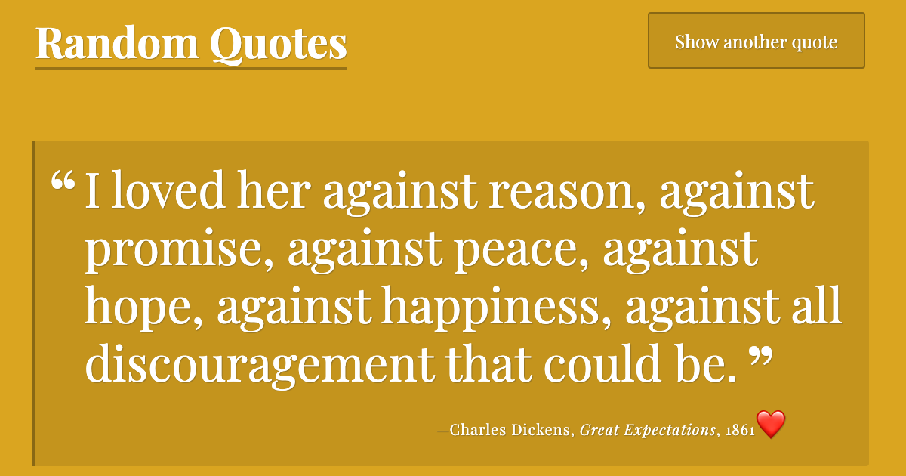

# Random Quote and Color Generator

## Description

This project utilizes JavaScript to dynamically present a random quote along with a background color. Additionally, it assigns an emoji to each quote based on predefined tags such as "humor," "love," and "mindfulness." The quotes and background colors are stored in separate arrays, allowing for random selection of both elements on each page load and when the "Show another quote" button is clicked. If you don't click the button, after an interval of 15 seconds the quote and background color will be re-generated.

[View Live Project](https://heidifryzell.com/js-random-quote-generator/)

### Future Improvement Suggestions

- generate the colors randomly using RGB instead of an array
- add more quotes
- use a quotes API instead of an array to retrieve quotes
